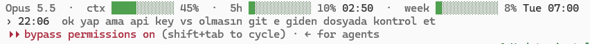

# claude-plus

Add-ons for [Claude Code](https://code.claude.com) on Windows.

- Built on Claude Code's own hooks and status line. Claude Code itself is not modified.
- Not affiliated with or endorsed by Anthropic.

## What you get



**Status line**
- Model, context used, 5-hour and weekly usage, with reset times.
- Green under 50 %, yellow under 80 %, red above.
- Usage bars need a claude.ai subscription.

**Last prompt**
- Your last prompt, on the second line.
- No more scrolling up to find what you asked.

**Context guard**
- At 90 % context, Claude writes everything down before auto-compaction.
- It commits finished work, updates `memory.md` and writes `handoff.md`.

**After compaction**
- Claude reads `handoff.md` and `memory.md` back.
- It tells you which files it read.

**New session**
- In a project with a `handoff.md`, Claude reads it first.
- No handoff, no message.

**Usage-limit fallback (optional)**
- When your usage limit runs out, a dialog offers to continue on z.ai's GLM model.
- Yes resumes the same session in a new window.
- Needs a z.ai API key. Without one, no dialog.
- **Yes sends the session's code and conversation to z.ai**, a third party.

## Requirements

- Windows 10 or 11
- [Claude Code](https://code.claude.com) and Python 3.8+ on `PATH`
- For the fallback: a [z.ai API key](https://z.ai/manage-apikey/apikey-list)

## Install

```
git clone https://github.com/firatada-ctrl/claude-plus
cd claude-plus
.\install.cmd
```

- No git? Download the ZIP (Code, Download ZIP), unpack, double-click `install.cmd`.
- Run it again to update.
- Restart open Claude Code sessions afterwards.

The installer:
- copies the scripts into `~/.claude` and `glm.cmd` into `~/.local/bin` (added to `PATH`);
- registers the hooks in `~/.claude/settings.json` (backup: `settings.json.before-claude-plus`);
- sets the status line only if you have none;
- creates `~/.claudex/profiles/glm/.env` for an optional z.ai key.

## Use your own steps

- Keep your own procedure, for example in your `CLAUDE.md`? Point to it in `~/.claude/claude-plus.local.json`:

```json
{ "rule": "the global CLAUDE.md, section \"Saving work before compaction\"" }
```

- The installer never touches this file.

## Uninstall

- Remove the claude-plus hooks and `statusLine` from `~/.claude/settings.json`, or restore the backup.
- Delete `~/.claude/statusline.py`, the three claude-plus scripts in `~/.claude/hooks` and `~/.local/bin/glm.cmd`.

## Limits

- Windows only.
- A short rate-limit error can also open the fallback dialog.
- After the fallback, close the old window yourself.

## Files

| File | Role |
|---|---|
| `statusline.py` | Status line |
| `prompt-recall.py` | Keeps the last prompt |
| `context-guard.py` | 90 % warning, compaction notes, read-back |
| `glm-fallback.py` | Usage-limit dialog |
| `glm.cmd` | Claude Code on z.ai GLM |
| `install.cmd`, `install.py` | Installer |

## License

[MIT](./LICENSE)
