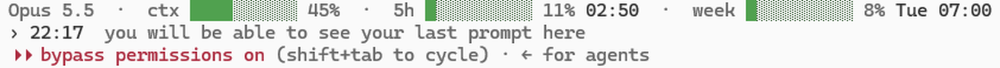

# claude-plus

A set of add-ons that makes [Claude Code](https://code.claude.com) on Windows safer and more pleasant to work with over long sessions.

- Everything runs through Claude Code's own extension points, its hooks and its status line, so Claude Code itself is never modified.
- This is an independent project and is not affiliated with or endorsed by Anthropic.

## What you get



**Status line**
- Shows the active model, how much of the context window is in use, and your 5-hour and weekly usage together with their reset times.
- Each bar changes colour as it fills: green below 50 %, yellow below 80 %, and red above that.

**Last prompt**
- You will be able to see your last prompt here, on the second line.
- There is no need to scroll back through a long answer to recall what you asked.

**Context Tracker**
- The status line lets you watch the context yourself, while claude-plus keeps track of it for you in the background at all times.

**Auto Save Before /compact, at 90 %**
- When the context reaches 90 %, well before Claude Code's own auto-compaction at about 97 %, Claude **automatically**:
  - commits the work that is finished and verified;
  - updates the project's `memory.md` with the current state, the decisions taken and the reasons behind them;
  - writes a `handoff.md` that records exactly where the work stands and what comes next.
- As a result, nothing learned during the session is lost when the conversation is compacted.

**After compaction**
- Right after the conversation has been compacted, Claude **automatically** reads `handoff.md` and `memory.md` back, so it continues from the full record instead of the short summary alone.
- Once it has read them, it tells you which `.md` files it read, so you always know what the session is working from.
- The same read-back also takes place when you start a new session in a project that has a `handoff.md`.

**Auto Switch to Free Models When Claude Tokens End**
- When your Claude usage limit runs out, a dialog offers to carry on with a **free** model, GLM by [z.ai](https://z.ai).
- Choosing Yes resumes the very same session, with its full conversation, in a new window.
- **The models it uses, GLM-4.7-Flash and GLM-4.5-Flash, are free on z.ai.**
- The switch requires a free z.ai API key; without one, the dialog never appears.

**Get your free z.ai API key**
1. Create an account at [z.ai](https://z.ai).
2. Go to the [API Keys](https://z.ai/manage-apikey/apikey-list) page and create a new key.
3. Copy the key.
4. Run `install.cmd`. It opens `~/.claudex/profiles/glm/.env` in Notepad; replace `PASTE_YOUR_KEY_HERE` with your key and save the file.

## Requirements

- Windows 10 or 11
- [Claude Code](https://code.claude.com) and Python 3.8 or newer, both available on `PATH`
- For the free-model switch only: a free [z.ai API key](https://z.ai/manage-apikey/apikey-list)

## Install

```
git clone https://github.com/firatada-ctrl/claude-plus
cd claude-plus
.\install.cmd
```

- If you do not use git, download the ZIP from this page (Code, Download ZIP), extract it and double-click `install.cmd`.
- To update, run the installer again; it is safe to run as often as you like.
- Restart any Claude Code session that is already open, since hooks are loaded when a session starts.

The installer:
- copies the scripts into `~/.claude`, and `glm.cmd` into `~/.local/bin`, which it adds to your `PATH`;
- registers the hooks in `~/.claude/settings.json`, after saving a backup as `settings.json.before-claude-plus`;
- sets up the status line only if you do not already have one;
- creates `~/.claudex/profiles/glm/.env`, where you can store the optional z.ai key.

## Use your own steps

- If you already keep your own procedure for saving work, for example in your `CLAUDE.md`, you can point claude-plus to it in `~/.claude/claude-plus.local.json`:

```json
{ "rule": "the global CLAUDE.md, section \"Saving work before compaction\"" }
```

- Claude will then follow your steps instead of the built-in ones. The installer never modifies this file, so your setting survives every update.

## Uninstall

- Remove the claude-plus hooks and the `statusLine` entry from `~/.claude/settings.json`, or restore the backup the installer created.
- Delete `~/.claude/statusline.py`, the three claude-plus scripts in `~/.claude/hooks`, and `~/.local/bin/glm.cmd`.

## Limits

- claude-plus runs on Windows only.
- A brief rate-limit error can occasionally open the free-model switch dialog as well.
- After switching, the original window stays open, so you may want to close it yourself.

## Files

| File | Role |
|---|---|
| `statusline.py` | Draws the status line and records the context figure |
| `prompt-recall.py` | Keeps your last prompt for the status line |
| `context-guard.py` | Handles the 90 % auto save, the compaction notes and the read-back |
| `glm-fallback.py` | Shows the free-model switch dialog when the usage limit is reached |
| `glm.cmd` | Runs Claude Code on z.ai's GLM models |
| `install.cmd`, `install.py` | The installer |

## License

[MIT](./LICENSE)
